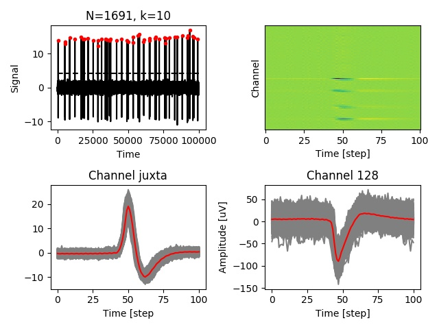

# SpykeSort

A python library for neural MEA data analysis and spike sorting.

Features include:
+ Raw data de-noising and filtering
+ Threshold and gradient-based spike detection
+ Clustering based on spike shape
+ Interactive visualization through Jupyter


## Installation on Linux/Unix

Use [pipenv](https://github.com/pypa/pipenv) to install SpykeSort and its dependencies on Linux or Unix:

``` sh
git clone https://github.com/d9w/SpykeSort
cd SpykeSort
pipenv install .
```

## Installation on Windows

[Download](https://github.com/d9w/SpykeSort/archive/refs/heads/main.zip) and unzip this repository in an accessible location such as Documents. Using [Anaconda](https://www.anaconda.com/), open an Anaconda shell and navigate using `cd` to the downloaded repository. Once there, do:

``` sh
conda install -c conda-forge pipenv
pipenv install .
```

## Testing

SpykeSort includes tests which run on sample data. Data is provided [here](https://zenodo.org/record/1205233#.XMH886xKjCI) from the article:

Yger, Pierre, et al. "A spike sorting toolbox for up to thousands of electrodes validated with ground truth recordings in vitro and in vivo." Elife 7 (2018): e34518.

The 20160426_patch3.tar.gz (md5:dfb6045c114b459b63373324963c82ba) file must be downloaded and extracted into the `data` directory:

``` sh
mkdir -p data
cd data
wget https://zenodo.org/record/1205233/files/20160426_patch3.tar.gz?download=1
tar xvzf 20160426_patch3.tar.gz
```

Verify that the downloaded image matches the following:


Comparison with other spike detection libraries on this dataset can be found [here](https://spikeforest.flatironinstitute.org/recording/paired_mea64c/20160426_patch3).

To execute these tests, run the following:

``` sh
py.test 
```


## Development

This project started as a [student project](https://github.com/Sylvain-Gutierrez/PIR) by Sylvain Gutierrez and Louise Placidet. It is currently maintained by [Dennis G Wilson](https://github.com/d9w/) and [Sylvain Cussat-Blanc](https://github.com/scussatb).
