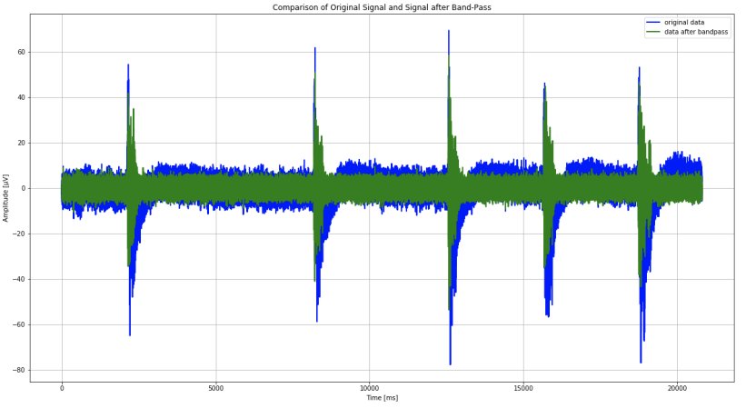
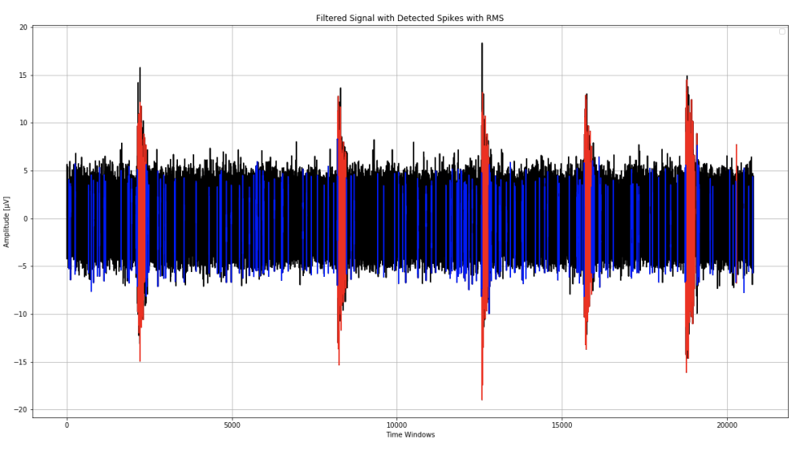

# SpykeSort

A python library for neural MEA data analysis and spike sorting.

Features include:
+ Raw data de-noising and filtering
+ Threshold and gradient-based spike detection
+ Clustering based on spike shape
+ Interactive visualization through Jupyter




## Installation on Linux/Unix

Use [pipenv](https://github.com/pypa/pipenv) to install SpykeSort and its dependencies on Linux or Unix:

``` sh
git clone https://github.com/d9w/SpykeSort
cd SpykeSort
pipenv install .
```

## Installation on Windows

[Download](https://github.com/d9w/SpykeSort/archive/refs/heads/main.zip) and unzip this repository in an accessible location such as Documents. Using [Anaconda](https://www.anaconda.com/), open an Anaconda shell and navigate using `cd` to the downloaded repository. Once there, do:

``` sh
conda install -c conda-forge pipenv
pipenv install .
```

## Testing

SpykeSort includes tests which run on sample data. To execute these tests, run the following:

``` sh
py.test 
```

## Development

This project started as a [student project](https://github.com/Sylvain-Gutierrez/PIR) by Sylvain Gutierrez and Louise Placidet. It is currently maintained by [Dennis G Wilson](https://github.com/d9w/) and [Sylvain Cussat-Blanc](https://github.com/scussatb).
